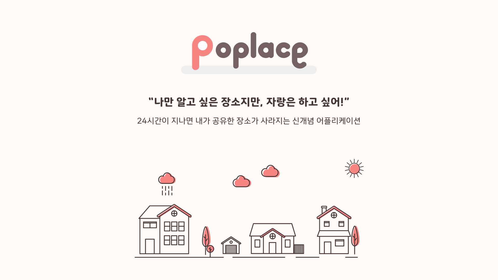

# Poplace
**`#은밀하게` `#나만의장소를` `#공유` `#24시간동안`**   
24시간이 지나면 내가 공유한 장소가 사라지는 신개념 어플리케이션!

왜, 그럴 때 있잖아요? 이 장소는 나만 알고 싶지만 그래도 은근하게 자랑은 하고 싶을 때 말이에요.   
그렇다면 Poplace를 잘 찾아오셨어요. Poplace는 현재 위치를 기준으로 나만 알고 싶은 장소를 공유할 수 있답니다.   
공유한 장소는 지도에서 보여지고, 24시간이 지나거나 누군가 저장하면 사라져요.   
은근하게 자랑하고 싶은 장소가 있다면 공유해보세요! 혹은 누군가 그 장소를 채 가기 전에 먼저 저장해보세요!   

<br>

# Contents
1. [Preview](#preview)   
2. [Repository](#repository)   
3. [Schedule](#schedule)   
4. [Features](#features)   
5. [Information](#information)
6. [Installation](#installation)
7. [Skills](#skills)
8. [신뢰와 충돌](#신뢰와-충돌)
9. [기술적 Challenges](#기술적-challenges)
10. [마무리하며..](#마무리하며)

<br>

# Preview
## Concept
  - Feeling
    - 뚜렷한 색은 지양 ❌
    - 혼자, 홀로
    - 은밀한, 오묘한
    - (UI적으로) 깔끔한
  - Reference (by design-seeds)
    |  [autumn-glow](https://www.design-seeds.com/seasons/autumn/autumn-glow/)                         |             [ color-harvest-4](https://www.design-seeds.com/seasons/autumn/color-harvest-4/)                   |
    | :-----------------------: | :---------------------------: |
     | 
    |                           |                               |
  - Main Color
    - [#453536](https://www.google.com/search?q=%23453536)
    - [#766162](https://www.google.com/search?q=%23766162)
    - [#F78582](https://www.google.com/search?q=%23F78582)
    - [#FFFFFF](https://www.google.com/search?q=%23FFFFFF)
## Manual
### 시작하기
구글 로그인으로 시작할 수 있고, 로그인 후에 프로필 이미지와 닉네임을 생성할 수 있습니다. 아무 것도 작성하지 않으면 기본 이미지와 추천 닉네임이 적용됩니다.

<span>
  
</span>
<span>
  
</span>
<span>
  
</span>
<span>
  
</span>
<br>
<br>

### 메인페이지
메인에 현재 나의 위치를 기준으로 1km 이내의 핀을 보여줍니다. 해당 핀을 클릭하면 모달창이 나오고 위로 끌어 올리면 상세페이지로 이동합니다.

<span>
  
</span>
<span>
  
</span>
<br>
<br>

### 핀 생성하기
하단 탭에 [+] 버튼을 누르면 핀 생성하기로 진입합니다. 은근하게 자랑하고 싶은 장소의 이미지와 태그, 내용을 작성합니다.   
핀을 생성하면 지도에 내 핀이 보여집니다.

<span>
  
</span>
<br>
<br>

### 마이페이지
하단에 세 번째 탭을 클릭하면 마이페이지로 이동합니다. 마이페이지에는 내 프로필 이미지와 닉네임, 내가 생성한 핀과 저장한 핀을 확인할 수 있습니다.   
더 보기를 클릭하면 내 핀의 리스트를 확인할 수 있습니다.   
핀을 클릭하면 상세페이지로 이동하고 자세한 핀 정보를 확인할 수 있습니다.   
설정페이지에서는 닉네임 변경, 로그아웃, 탈퇴하기를 할 수 있습니다.

<span>
  
</span>
<span>
  
</span>
<span>
  
</span>
<span>
  
</span>
<br>
<br>

# Repository
## Client
- https://github.com/poplace/poplace-client
## Server
- https://github.com/poplace/poplace-server

<br>

# Schedule
- 프로젝트 기간: 2021. 8. 30 ~ 9. 17
- `1주차` - 기획 및 설계
  - 아이디어 검토 및 기술 스택 결정
  - Prototype Sketch
  - Database Schema 설계
  - Server Endpoint 정의
  - Git, Code Style 조율
  - Task Scheduling 및 Role 정의
  - 개발 환경 셋업
      - React Native Expo
      - Express (Node.js)
- `2주차` - 기능 개발
  - Google Login 연동
  - Google Maps 연동
  - 이미지 저장을 위한 AWS S3 연동
  - 계정 프로필 이미지, 닉네임 생성 페이지
  - 클라이언트 요청을 위한 API 서버 구축
  - State 관리를 위한 Redux Toolkit, Thunk 작업
  - 핀 생성 후 서버 및 클라이언트에 24시간 카운트되는 기능 작업
- `3주차` - 마무리
  - User Experience를 위한 Load Test 및 버그 수집 및 개선
  - Code Style 통일, Component 분리 작업
  - 앱 Icon, Splash 화면 등의 디자인 작업
  - 파일, 폴더 구조 개선
  - Client / Server Test Code 작성
  - Client / Server 배포
      - Client : Google Play Store
      - Server : Amazon Elastic Beanstalk

<br>

# Features
- 유저 로그인
    - Expo Google App Auth를 통해 Google Login 연동을 진행했습니다.
    - Google Cloud APIs에서  발급받은 Client ID를 이용하여 유저를 인증하고 유저의 정보를 서버로 보냅니다.
    - 서버에서 해당 정보를 토대로 JWT 토큰을 받급하여 클라이언트로 전달한 후에 Secure Store에 저장됩니다.
    - 발급받은 토큰을 토대로 서버에 접근이 필요할 때마다 토큰을 서버에 전송하여 해당 토큰을 인증한 후 접근을 허가합니다.
- 메인 페이지에 네비게이션 탭, 생성된 핀 노출
    - React Native Maps를 통해 메인 페이지에 구글맵을 보여줍니다.
    - 생성한 핀은 서버의 MongoDB에 저장되고, 메인 진입시 서버로부터 전달 받은 핀 데이터를 지도에 보여줍니다.
    - Redux Thunk를 통해 핀 데이터를 비동기적으로 서버에 요청한 후에 받은 데이터를 store에 보관합니다.
    - 지도에 보여지는 핀은 현재 위치를 기준으로 반경 1km 까지 보여주도록 설정하였습니다.
- 핀 생성하기
    - Amazon AWS S3를 연동하여 이미지 URI를 S3 Bucket에 관리하도록 하였습니다.
    - 이미지, 태그, 본문 내용을 입력한 후에 생성 완료를 누르면 지도에 해당 데이터가 담긴 핀이 생성됩니다.
- 마이페이지
    - 프로필 이미지와 계정을 보여주고, 프로필 이미지를 변경할 수 있습니다.
    - 내가 생성한 핀과 내가 저장한 핀의 이미지가 Horizontal ScrollView로 보여집니다.
    - 더 보기를 클릭하면 태그, 본문 내용, 남은시간이 포함된 핀 리스트를 보여줍니다.
    - 헤더 오른쪽 설정 아이콘을 통해 설정페이지로 진입이 가능하며 닉네임 변경, 로그아웃, 탈퇴하기를 할 수 있습니다.
- 남은 시간
    - Node Schedule을 통해 서버에서 핀의 생성된 날짜와 저장된 날짜를 확인합니다.
    - 24시간이 지나면 서버의 핀 데이터에 active가 false로 바뀌며, 클라이언트에서는 렌더링될 때마다 서버로부터 받은 핀 데이터 중에 active가 false인 것은 보여지지 않도록 합니다.

<br>

# Information
- Mobile : Android
- Version
    - React Native 0.65.1
    - Node.js 14.17.5
    - Express 4.16.1

<br>

# Installation
## Setup
- Local 환경에서 실행하기 위해 아래 사전 준비가 필요합니다.
  - [Android Client ID, IOS Client ID](https://console.cloud.google.com/apis/dashboard?project=decent-answer-325111)
  - [MongoDB Address](https://www.mongodb.com/ko-kr/cloud/atlas/efficiency)
  - [AWS S3 Bucket](https://s3.console.aws.amazon.com/s3/home)
  - [Identity Pool ID](https://console.aws.amazon.com/cognito/home)
## Client
```
git clone https://github.com/poplace/poplace-client
cd poplace-client
npm install
npm start // or expo start
```

- root 디렉토리에 `.env` 파일을 생성하고 `<>`에 환경변수를 입력 후 저장해야 합니다.

```js
ANDROID_CLIENT_ID=<android client id>
IOS_CLIENT_ID=<iod client id>
API_SERVER_URL=http://poplace-env.eba-bvmskfvh.ap-northeast-2.elasticbeanstalk.com/
DEFAULT_IMAGE_URL=https://vaco-poplace.s3.ap-northeast-2.amazonaws.com/default-image.jpeg
```
## Server
```
git clone https://github.com/poplace/poplace-server
cd poplace-server
npm install
npm start
```

- root 디렉토리에 `.env` 파일을 생성하고 `<>`에 환경변수를 입력 후 저장해야 합니다.

```js
MONGODB_ADDRESS=<mongoDB address>
AWS_S3_BUCKET_NAME=<aws s3 bucket name>
AWS_REGION=<aws region>
IDENTITY_POOL_ID=<aws identity pool id>
SECRET_KEY=<secret key>
```

<br>

# Skills

## Client
- ES2015+
- React Native (Expo)
- React Native Navigation
- React Native Maps
- React Native StyleSheet
- React Redux Toolkit / Thunk
- Axios

## Server
- ES2015+
- Node.js
- Express
- MonogoDB Atlas
- Mongoose
- AWS S3
- JSON Web Token
- Multer
- Node Schedule

## etc.
- Eslint
- Prettier

<br>

# 신뢰와 충돌
## 초기 기획 과정에서 동상이몽

일정 시간이 지나거나 저장했을 때 핀이 사라지는 등 기존에 볼 수 없었던 생소한 콘셉트의 앱이었기 때문에 초기에 아이디어가 합의된 줄 알았지만 각자 디테일한 부분에서 조금씩 다른 생각을 가지고 있었습니다.

매일 스크럼을 진행하면서 핀트가 맞지 않는 부분을 캐치하고 서로가 가지고 있던 세부적인 기능에 대해 공유하면서 산재되어 있던 아이디어의 조각들이 하나 둘 씩 맞춰졌습니다.

서로 공유하고 재정립하면서 유저가 생각하기에 복잡한 기능을 덜어내고 좀 더 간결한 기능을 가진 서비스를 만들기 위해 기획을 좁혀나갔습니다.

<br>

## 데이터를 살릴 것인가 vs 지울 것인가

앱에서 핀을 생성하고 일정 시간이 지나면 지도에서 해당 핀이 사라지는 콘셉트이기 때문에 핀이 사라질 때 데이터도 삭제 시키는 게 어떻겠냐는 의견과 데이터는 중요하고 실제 서비스라면 당연히 데이터는 가지고 있는게 맞으며 UI상으로만 보이지 않게 하자는 의견이 충돌했습니다.

결론적으로 우리의 메인 데이터는 유저 데이터와 게시글 데이터이기 때문에 데이터를 가지고 활용할 수 있는게 많다는 점과 앱의 확장성에 중점을 두어 데이터를 관리해야 한다고 합의가 되었습니다.

<br>

## 문제 해결의 우선순위

기능 개발에서  특정 문제에 봉착했을 때 해결을 한 뒤에 다음 작업으로 넘어갈지 특정 문제를 인지한 상태에서 일단은 다음 작업을 진행하고 최종적으로 완료되었을 때 보는 게 맞는지에 대한 엇갈린 의견이 있었습니다.

3주라는 프로젝트 기간이 정해져 있었기 때문에 선택과 집중이 필요했습니다.

해당 문제가 객관적으로 보기에 중요한 문제라면 먼저 해결 후에 다음 작업으로 넘어가기로 했습니다. 하지만 팀원 간의 합의하에 우선순위가 아니라면 일단은 해당 문제를 팀원들이 모두 볼 수 있는 공간에 적어두고 마무리 단계에서 같이 확인하기로 결정했습니다.

<br>

# 기술적 Challenges
## MongoDB의 indexing과 Aggregation

로그인이 완료된 후 지도를 나타내주고, 사용자가 생성한 핀의 정보를 DB에서 불러와 올바른 위치에 보여주는 로직을 작성했습니다.

해당 로직에서 한가지 고려하며 구현한것은 지도위에 모든 핀을 보여주는 것이 아닌, 사용자가 보고 있는 화면을 기준으로 1km 이내에 있는 핀의 데이터만 DB에서 가져와 보여주는 것이었습니다.

이때, indexing과 Aggregation을 사용했습니다. (해당 기능은 GeoJson을 사용합니다.)

indexing과 Aggregation을 처음 접해, 해당 기능의 역할과 사용법을 익히는데에 어려움을 겪었으나, 공식문서와 많은 예제코드의 도움을 받아 의도한대로 데이터를 가져올 수 있었습니다.

<br>

## 클라이언트에서 AWS S3를 연동

앱 진입시, 로그인 후에 계정 생성 페이지는 프로필 이미지 삽입 페이지와 닉네임 생성 페이지가 있습니다. 작성 후 완료 버튼을 누르면 서버 쪽 DB로 데이터가 들어갑니다.

서버 DB로 들어가기 전 프로필 이미지 삽입 페이지에서 프로필 이미지를 삽입하면 해당 이미지의 로컬 URL을 AWS S3에 업로드하고 만들어진 AWS S3 URL을 클라이언트가 받아 닉네임 작성까지 한 후에 최종적으로 서버 DB로 보내는 방법을 생각했습니다.

클라이언트에서 AWS S3까지 이미지를 업로드하는 것은 성공했으나, 이미지가 제대로 보이지 않는 현상을 발견했고 원인을 찾던 중 서버 쪽에서 AWS S3를 연동하는 형태가 일반적이라는 사실을 알게 되었습니다.

결국 서버 쪽에서 multipart/form-data를 다루는 Node.js 미들웨어인 multer를 사용하여 AWS S3 연동을 성공하였습니다.

<br>

<br>

# 마무리하며..
이번 프로젝트에서 React Native를 처음 시도해보았습니다. React와 같은 구조이기 때문에 큰 어려움 없이 기능 개발이 이뤄질 것이라 예상했습니다. 하지만 그 예상은 정확히 빗나갔습니다.

React Native Expo를 통해 진행을 했기 때문에 초기 셋업 과정은 순조웠으나 Emulator의 불안정한 호환성과 알 수 없는 오류들로 인해 프로젝트 기간에 큰 부분을 오류와 씨름해야 했습니다.

작업 당시, 개발을 시작하기도 전에 오류를 해결하는데 시간을 쓰는 것에 대해 아쉬움이 컸지만 결론적으로 문제를 해결하기 위해 원인을 찾아가는 과정을 배웠다고 생각합니다.
